# 📰 NewsPulse — Real-Time News Intelligence Platform

<div align="center">


**A cutting-edge news intelligence platform powered by ML, NLP, and AI.**

Live headline collection → Real-time analysis → Actionable insights

[Features](#-features) • [Architecture](#-architecture) • [Quick Start](#-quick-start) • [API Reference](#-api-endpoints) • [Tech Stack](#-tech-stack)

</div>

---

## ✨ Features

### 🔄 Real-Time News Collection
- **Automated Polling** — Headlines fetched every 30 minutes from top US news sources
- **48-Hour Rolling Cache** — SQLite-powered time-series storage
- **Source Diversity** — Multiple trusted news outlets via NewsAPI

### 🧠 Machine Learning Analysis

| Feature | Technology | Description |
|---------|------------|-------------|
| **Sentiment Analysis** | scikit-learn | Classifies news as positive, neutral, or negative |
| **Entity Extraction** | spaCy NER | Identifies people, organizations, and locations |
| **Topic Modeling** | BERTopic | Discovers hidden themes across articles |
| **Article Clustering** | DBSCAN + HDBSCAN | Groups related stories automatically |
| **Trend Detection** | NLP + Growth Tracking | Surfaces emerging vs established trends |

### 🚨 Breaking News Detection
Multi-signal algorithm combining:
- **Volume Spike** (40%) — Unusual article frequency
- **Novel Entities** (35%) — New names appearing suddenly  
- **Rapid Clustering** (25%) — Multiple sources covering same story

### 🤖 AI-Powered Features
- **Smart Summarization** — Google Gemini generates concise article summaries
- **Related Stories** — Semantic similarity finds connected coverage
- **Semantic Search** — Embedding-powered article discovery

---

## 🏗 Architecture

### System Overview

```mermaid
flowchart TB
    subgraph External["☁️ External Services"]
        NewsAPI["📡 NewsAPI"]
        Gemini["🤖 Google Gemini"]
    end
    
    subgraph Backend["⚙️ FastAPI Backend"]
        Poller["HeadlinePoller\n(30min interval)"]
        DB[(SQLite DB)]
        
        subgraph ML["🧠 ML Services"]
            Sentiment["Sentiment\nAnalyzer"]
            NER["spaCy\nNER"]
            Clusterer["Article\nClusterer"]
            TopicModel["BERTopic\nModeler"]
            Breaking["Breaking News\nDetector"]
        end
        
        API["REST API\nEndpoints"]
    end
    
    subgraph Frontend["⚛️ React Frontend"]
        UI["Dashboard UI"]
        Search["Search View"]
        Components["Components\n• BreakingNews\n• Topics\n• Trends"]
    end
    
    NewsAPI -->|Headlines| Poller
    Poller -->|Store| DB
    DB -->|Articles| ML
    ML -->|Enriched Data| API
    Gemini -->|Summaries| API
    API -->|JSON| Frontend
    Frontend -->|User Actions| API
```



### Data Flow Pipeline

```mermaid
flowchart LR
    subgraph Ingestion["📥 Ingestion"]
        A[NewsAPI] --> B[HeadlinePoller]
        B --> C[(SQLite)]
    end
    
    subgraph Processing["⚙️ Processing"]
        C --> D[Sentiment Analysis]
        C --> E[Entity Extraction]
        C --> F[Embedding Generation]
        F --> G[Topic Modeling]
        F --> H[Article Clustering]
    end
    
    subgraph Detection["🔔 Detection"]
        C --> I[Volume Analysis]
        E --> J[Novel Entity Check]
        H --> K[Rapid Clustering]
        I & J & K --> L[Breaking Score]
    end
    
    subgraph Delivery["📤 Delivery"]
        D & E & G & L --> M[REST API]
        M --> N[React Frontend]
    end
```



### Project Structure


---

## 🚀 Quick Start

### Prerequisites
- Python 3.13+
- Node.js 18+
- NewsAPI key ([get one free](https://newsapi.org))
- Google Gemini API key ([get one free](https://makersuite.google.com/app/apikey))

### Backend Setup

```bash
# Navigate to backend
cd backend

# Install dependencies
pip install -r requirements.txt

# Download spaCy model
python -m spacy download en_core_web_sm

# Train sentiment model
python scripts/train_sentiment.py

# Create .env file
echo "NEWS_API_KEY=your_newsapi_key_here" > .env
echo "GEMINI_API_KEY=your_gemini_api_key_here" >> .env

# Start server
uvicorn main:app --reload
```

Backend runs at `http://localhost:8000`

### Frontend Setup

```bash
# Navigate to frontend
cd frontend

# Install dependencies
npm install

# Start dev server
npm run dev
```

Frontend runs at `http://localhost:5173`

---

## 📡 API Endpoints

### Core Endpoints

| Endpoint | Method | Description |
|----------|--------|-------------|
| `/trends` | GET | Trending keywords with growth metrics |
| `/entities` | GET | Trending people, orgs, locations |
| `/search?q=keyword` | GET | Search articles with ML analysis |
| `/summarize` | POST | AI summarization via Gemini |

### ML Endpoints

| Endpoint | Method | Description |
|----------|--------|-------------|
| `/topics` | GET | BERTopic-discovered themes |
| `/breaking` | GET | Breaking news detection |
| `/related-by-url` | GET | Find semantically similar articles |
| `/sentiment` | POST | Analyze text sentiment |

### Utility Endpoints

| Endpoint | Method | Description |
|----------|--------|-------------|
| `/health` | GET | Health check |
| `/articles` | GET | Paginated article list |

---

## 🛠 Tech Stack

### Backend
| Technology | Purpose |
|------------|---------|
| **FastAPI** | High-performance async API framework |
| **Python 3.13** | Core language |
| **SQLite + aiosqlite** | Lightweight async database |
| **spaCy** | Named Entity Recognition |
| **scikit-learn** | Sentiment analysis, DBSCAN clustering |
| **BERTopic** | Neural topic modeling |
| **sentence-transformers** | Semantic embeddings |
| **UMAP + HDBSCAN** | Dimensionality reduction & clustering |
| **Google Gemini** | AI summarization |

### Frontend
| Technology | Purpose |
|------------|---------|
| **React 18** | UI framework |
| **Vite** | Fast dev server & bundler |
| **Tailwind CSS** | Utility-first styling |
| **PropTypes** | Runtime type checking |

---

## 📊 ML Model Details

### Sentiment Analyzer
- **Model**: Logistic Regression with TF-IDF vectorization
- **Training Data**: Custom labeled news dataset
- **Output**: `positive`, `neutral`, `negative` with confidence score

### Topic Modeler
- **Model**: BERTopic with sentence-transformers
- **Embeddings**: `all-MiniLM-L6-v2` (384-dim)
- **Clustering**: HDBSCAN for dynamic topic discovery
- **Output**: Topic labels, keywords, article counts

### Breaking News Detector
- **Volume Signal**: Compares 1-hour vs 12-hour baseline
- **Entity Signal**: Tracks newly appearing named entities
- **Clustering Signal**: Monitors rapid article grouping
- **Threshold**: Score ≥ 60 triggers breaking status

---

## 🚢 Deployment

### Frontend → Vercel
1. Connect GitHub repo
2. Set root directory to `frontend`
3. Deploy

### Backend → Render
1. Create new Web Service
2. Set root directory to `backend`
3. Add environment variables
4. Deploy

---

## 👤 Author

**Sriram Madala**

[](https://www.linkedin.com/in/sriram-madala-68799728b)
[](https://github.com/SriramWorkSpace)

---

## 📄 License

This project is licensed under the MIT License - see the [LICENSE](LICENSE) file for details.

---

<div align="center">

Made with ❤️ by Sriram Madala

</div>

**Important:** Attach a **persistent disk** to the Render service for `backend/news.db` to preserve trend history across deploys.

Set environment variables:
- `NEWS_API_KEY`
- `GEMINI_API_KEY`

## Testing

Run backend tests:
```powershell
cd backend
py -m pytest -q
```

## Author
Sriram
