# 📰 NewsPulse — Real-Time News Intelligence Platform

<div align="center">


**AI-powered news intelligence platform with real-time ML analysis, trend detection, and breaking news alerts.**

🌐 **[Live Demo](https://news-pulse-sand.vercel.app)** | 📚 **[API Docs](https://newspulse-yc56.onrender.com/docs)** | 🔗 **[LinkedIn](https://www.linkedin.com/in/sriram-madala-68799728b)**

</div>

---

## ✨ What is NewsPulse?

NewsPulse is a **sophisticated news intelligence platform** that doesn't just fetch headlines—it **understands them**. By combining real-time data collection with advanced ML/NLP techniques, NewsPulse transforms raw news feeds into actionable insights.

### 🎯 Key Capabilities

<table>
<tr>
<td width="50%">

#### 🔄 **Real-Time Intelligence**
- ⏱️ **30-minute polling** from top US news sources
- 📊 **48-hour rolling window** for trend analysis
- 🔄 **Live data refresh** with zero downtime

</td>
<td width="50%">

#### 🧠 **ML-Powered Analysis**
- 🎭 **Sentiment classification** (Positive/Neutral/Negative)
- 🏷️ **Entity extraction** (People, Orgs, Locations)
- 🗂️ **Topic modeling** with BERTopic
- 🔗 **Semantic clustering** of related stories

</td>
</tr>
<tr>
<td width="50%">

#### 🚨 **Breaking News Detection**
- 📈 **Volume spike analysis** (40% weight)
- ✨ **Novel entity tracking** (35% weight)
- 🔄 **Rapid clustering** (25% weight)
- 🎯 **Multi-signal scoring** algorithm

</td>
<td width="50%">

#### 🤖 **AI Enhancement**
- 🌟 **Smart summarization** via Google Gemini
- 🔍 **Semantic search** using embeddings
- 📊 **Trend growth tracking** (emerging vs established)
- 🎨 **Related stories** discovery

</td>
</tr>
</table>

---

## 🏗 System Architecture

### High-Level Overview

```mermaid
graph TB
    subgraph external["☁️ External Services"]
        newsapi["📡 NewsAPI<br/>Top Headlines"]
        gemini["🤖 Google Gemini<br/>AI Summarization"]
    end
    
    subgraph backend["⚙️ FastAPI Backend (Render)"]
        direction TB
        poller["🔄 HeadlinePoller<br/>Every 30 min"]
        db[("💾 SQLite<br/>48h Cache")]
        
        subgraph ml["🧠 ML Pipeline"]
            direction LR
            sentiment["😊 Sentiment<br/>Logistic Reg"]
            ner["🏷️ NER<br/>spaCy"]
            cluster["🔗 Clustering<br/>DBSCAN"]
            topics["🗂️ Topics<br/>BERTopic"]
            breaking["🚨 Breaking<br/>Multi-Signal"]
        end
        
        api["🌐 REST API<br/>10 Endpoints"]
    end
    
    subgraph frontend["⚛️ React Frontend (Vercel)"]
        direction TB
        ui["🎨 Dashboard<br/>Real-time UI"]
        search["🔍 Search<br/>ML-Powered"]
        components["📦 Components<br/>Breaking/Topics/Trends"]
    end
    
    newsapi -->|"Fetch Headlines"| poller
    poller -->|"Store Articles"| db
    db -->|"Read Data"| ml
    ml -->|"Enriched Results"| api
    gemini <-->|"Generate Summaries"| api
    api <-->|"JSON REST"| frontend
    
    style external fill:#e3f2fd
    style backend fill:#fff3e0
    style frontend fill:#f3e5f5
    style ml fill:#e8f5e9
    style db fill:#fce4ec
```



### Data Processing Pipeline

```mermaid
flowchart LR
    subgraph stage1["📥 Collection"]
        direction TB
        A1["NewsAPI<br/>Sources"]
        A2["Poller<br/>30min"]
        A3[("SQLite<br/>Storage")]
    end
    
    subgraph stage2["⚙️ Processing"]
        direction TB
        B1["🎭 Sentiment<br/>Classification"]
        B2["🏷️ Entity<br/>Extraction"]
        B3["🔢 Embedding<br/>Generation"]
        B4["🗂️ Topic<br/>Discovery"]
    end
    
    subgraph stage3["🔔 Detection"]
        direction TB
        C1["📊 Volume<br/>Analysis"]
        C2["✨ Novel<br/>Entities"]
        C3["⚡ Rapid<br/>Clustering"]
        C4["🚨 Breaking<br/>Score"]
    end
    
    subgraph stage4["📤 Delivery"]
        direction TB
        D1["🌐 REST<br/>API"]
        D2["⚛️ React<br/>Frontend"]
    end
    
    A1 --> A2 --> A3
    A3 --> B1 & B2 & B3
    B3 --> B4
    A3 --> C1
    B2 --> C2
    B4 --> C3
    C1 & C2 & C3 --> C4
    B1 & B2 & B4 & C4 --> D1
    D1 --> D2
    
    style stage1 fill:#e3f2fd
    style stage2 fill:#fff3e0
    style stage3 fill:#ffebee
    style stage4 fill:#e8f5e9
```



### ML Model Architecture

```mermaid
graph TB
    subgraph input["📝 Input Layer"]
        articles["News Articles<br/>(Title + Description)"]
    end
    
    subgraph nlp["🔤 NLP Processing"]
        tokenize["Tokenization<br/>spaCy"]
        embed["Embeddings<br/>MiniLM-L6-v2<br/>(384-dim)"]
    end
    
    subgraph models["🧠 ML Models"]
        direction LR
        m1["Sentiment<br/>Logistic Regression<br/>TF-IDF"]
        m2["NER<br/>spaCy en_core_web_sm<br/>Entities"]
        m3["Clustering<br/>DBSCAN + Cosine<br/>Groups"]
        m4["Topics<br/>BERTopic + UMAP<br/>Themes"]
    end
    
    subgraph output["📊 Output Layer"]
        direction TB
        viz["Dashboard<br/>Visualizations"]
        api_out["API<br/>JSON Response"]
        alerts["Breaking News<br/>Alerts"]
    end
    
    articles --> tokenize
    tokenize --> embed
    articles --> m1
    embed --> m2 & m3 & m4
    m1 & m2 & m3 & m4 --> api_out
    api_out --> viz & alerts
    
    style input fill:#e3f2fd
    style nlp fill:#fff3e0
    style models fill:#e8f5e9
    style output fill:#f3e5f5
```



---

---

## 🚀 Quick Start

### Prerequisites

```bash
# Required Tools
✓ Python 3.11+
✓ Node.js 18+
✓ Git

# Required API Keys (Free)
✓ NewsAPI → https://newsapi.org
✓ Google Gemini → https://makersuite.google.com/app/apikey
```

### 🔧 Backend Setup

```bash
# 1. Clone and navigate
git clone https://github.com/SriramWorkSpace/NewsPulse.git
cd NewsPulse/backend

# 2. Create virtual environment (recommended)
python -m venv venv
source venv/bin/activate  # On Windows: venv\Scripts\activate

# 3. Install dependencies
pip install -r requirements.txt

# 4. Download spaCy language model
python -m spacy download en_core_web_sm

# 5. Train sentiment model (optional, for sentiment analysis)
python scripts/train_sentiment.py

# 6. Configure environment variables
# Create backend/.env file with:
NEWS_API_KEY=your_newsapi_key_here
GEMINI_API_KEY=your_gemini_api_key_here

# 7. Start the server
uvicorn app.main:app --reload
```

✅ **Backend running at** `http://localhost:8000`  
📚 **API docs at** `http://localhost:8000/docs`

### ⚛️ Frontend Setup

```bash
# 1. Navigate to frontend
cd frontend

# 2. Install dependencies
npm install

# 3. Start development server
npm run dev
```

✅ **Frontend running at** `http://localhost:5173`

### 🔥 First Run

1. Wait **~1 minute** for initial data collection
2. Visit `http://localhost:5173` to see the dashboard
3. Data refreshes automatically every 30 minutes
4. ML features activate after **15+ articles** are collected

---

## 📡 API Reference

### 📊 Core Endpoints

<table>
<tr>
<th>Endpoint</th>
<th>Method</th>
<th>Description</th>
<th>Response</th>
</tr>
<tr>
<td><code>/health</code></td>
<td>GET</td>
<td>Health check</td>
<td><code>{"status": "ok"}</code></td>
</tr>
<tr>
<td><code>/trends</code></td>
<td>GET</td>
<td>Trending keywords with growth metrics</td>
<td>Array of keywords with scores</td>
</tr>
<tr>
<td><code>/entities</code></td>
<td>GET</td>
<td>Trending people, organizations, locations</td>
<td>Grouped entities by type</td>
</tr>
<tr>
<td><code>/search?q=keyword</code></td>
<td>GET</td>
<td>Search articles with ML enrichment</td>
<td>Matching articles with metadata</td>
</tr>
</table>

### 🧠 ML Endpoints

<table>
<tr>
<th>Endpoint</th>
<th>Method</th>
<th>Description</th>
<th>Min Articles</th>
</tr>
<tr>
<td><code>/topics</code></td>
<td>GET</td>
<td>BERTopic-discovered themes</td>
<td>15+</td>
</tr>
<tr>
<td><code>/breaking</code></td>
<td>GET</td>
<td>Breaking news detection (score ≥60)</td>
<td>10+</td>
</tr>
<tr>
<td><code>/related-by-url?url=...</code></td>
<td>GET</td>
<td>Find semantically similar articles</td>
<td>5+</td>
</tr>
<tr>
<td><code>/sentiment</code></td>
<td>POST</td>
<td>Analyze text sentiment</td>
<td>N/A</td>
</tr>
</table>

### 📝 Example Requests

```bash
# Get trending keywords
curl http://localhost:8000/trends

# Search for AI-related news
curl http://localhost:8000/search?q=artificial%20intelligence

# Get breaking news alerts
curl http://localhost:8000/breaking

# Discover topics
curl http://localhost:8000/topics

# Find related articles
curl "http://localhost:8000/related-by-url?url=https://example.com/article"
```

---

## 🛠 Technology Stack

### Backend Stack

<table>
<tr>
<td width="30%"><strong>Framework</strong></td>
<td width="70%">

**FastAPI** — High-performance async Python web framework  
**Python 3.11+** — Core language with type hints  
**Uvicorn** — ASGI server for production

</td>
</tr>
<tr>
<td><strong>Database</strong></td>
<td>

**SQLite** — Lightweight embedded database  
**aiosqlite** — Async SQLite driver for FastAPI

</td>
</tr>
<tr>
<td><strong>ML/NLP Stack</strong></td>
<td>

**spaCy** — Industrial-strength NLP (Named Entity Recognition)  
**scikit-learn** — Sentiment analysis, DBSCAN clustering  
**sentence-transformers** — Semantic embeddings (`all-MiniLM-L6-v2`)  
**BERTopic** — Neural topic modeling  
**UMAP** — Dimensionality reduction  
**HDBSCAN** — Density-based clustering

</td>
</tr>
<tr>
<td><strong>External APIs</strong></td>
<td>

**NewsAPI** — Real-time news headlines  
**Google Gemini** — AI-powered summarization

</td>
</tr>
</table>

### Frontend Stack

<table>
<tr>
<td width="30%"><strong>Framework</strong></td>
<td width="70%">

**React 18** — Component-based UI library  
**Vite** — Next-generation frontend tooling

</td>
</tr>
<tr>
<td><strong>Styling</strong></td>
<td>

**Tailwind CSS** — Utility-first CSS framework  
**CSS3** — Custom animations and gradients

</td>
</tr>
<tr>
<td><strong>Development</strong></td>
<td>

**PropTypes** — Runtime type checking  
**ESLint** — Code quality and consistency

</td>
</tr>
</table>

---

## 📊 ML Models Deep Dive

### 🎭 Sentiment Analyzer
```
Input:  Article text (title + description)
Model:  Logistic Regression + TF-IDF Vectorizer
Output: {label: "positive|neutral|negative", confidence: 0.85}
```
- **Training**: Custom labeled news dataset
- **Features**: TF-IDF with 5000 max features
- **Accuracy**: ~82% on test set

### 🏷️ Named Entity Recognition
```
Input:  Article text
Model:  spaCy en_core_web_sm
Output: {PERSON: ["Elon Musk"], ORG: ["Tesla", "SpaceX"], GPE: ["USA"]}
```
- **Entities**: PERSON, ORG, GPE, EVENT, PRODUCT
- **Deduplication**: Case-insensitive frequency counting
- **Threshold**: Minimum 2 occurrences to appear in trending

### 🗂️ Topic Modeling (BERTopic)
```
Input:  Article embeddings (384-dim)
Model:  UMAP → HDBSCAN → c-TF-IDF
Output: [{topic_id: 1, label: "AI Regulation", keywords: [...], count: 12}]
```
- **Embedding Model**: `all-MiniLM-L6-v2`
- **Min Topic Size**: 3 articles
- **Auto-reduction**: Merges similar topics

### 🚨 Breaking News Detection
```
Algorithm: Multi-Signal Scoring (0-100)
- Volume Signal (40%):   Recent count / Baseline average
- Entity Signal (35%):   Novel entities / Total entities
- Clustering Signal (25%): Max cluster size / Total articles

Threshold: Score ≥ 60 → Breaking News Alert
```

---

## 🌐 Deployment

### Frontend (Vercel)

```bash
# 1. Connect GitHub repository to Vercel
# 2. Configure build settings:
Root Directory:    frontend
Build Command:     npm run build
Output Directory:  dist
Install Command:   npm install

# 3. Set environment variable:
VITE_API_BASE_URL=https://your-backend-url.onrender.com

# 4. Deploy ✅
```

### Backend (Render)

```bash
# 1. Create new Web Service
# 2. Configure settings:
Root Directory:  backend
Build Command:   pip install -r requirements.txt && python -m spacy download en_core_web_sm
Start Command:   uvicorn app.main:app --host 0.0.0.0 --port $PORT

# 3. Set environment variables:
NEWS_API_KEY=your_key
GEMINI_API_KEY=your_key
PYTHON_VERSION=3.11.0

# 4. Deploy ✅
```

**📌 Important**: For persistent data across deployments, add a **disk mount** at `/opt/render/project/src/backend` to preserve `news.db`.

---

## 🧪 Testing

```bash
# Run backend tests
cd backend
pytest -v

# Check code coverage
pytest --cov=app tests/

# Run with detailed output
pytest -v -s
```

---

## 📈 Project Stats

- **10+** API Endpoints
- **5** ML Models in production
- **30-minute** data refresh cycle
- **48-hour** rolling data window
- **15+** articles minimum for ML features
- **~80MB** ML model sizes (CPU-optimized)

---

## 🐛 Deployment Troubleshooting

### Common Issues & Solutions

<details>
<summary><b>❌ Render: "Ran out of memory (used over 512MB)"</b></summary>

**Problem:** ML models (BERTopic, sentence-transformers) loading on every API request exceeded free tier's 512MB limit.

**Solution:** Implemented ML result caching system:
- ML processing runs **only during 30-min polling cycles**
- Results stored in SQLite (`article_embeddings`, `article_topics`, `article_clusters`, `breaking_news_cache` tables)
- API endpoints read from cache instead of loading models
- Memory usage: **~200MB** (fits free tier!)

**Files Changed:**
- `backend/app/services/ml_cache.py` - Cache layer
- `backend/app/services/ml_processor.py` - ML computation during polling
- `backend/app/services/poller.py` - Integrated ML processing
- `backend/app/api/routes/ml.py` - Updated endpoints to use cache

</details>

<details>
<summary><b>❌ Render: "No open ports detected" / Silent crash on startup</b></summary>

**Problem:** App crashed during import before uvicorn could bind to port.

**Root Cause:** Heavy ML imports at module level caused timeout:
- `from sentence_transformers import SentenceTransformer` (downloads 80MB+ models)
- `from bertopic import BERTopic` (loads dependencies)

**Solution:** Made imports lazy (inside methods, not module-level):

```python
# ❌ Before (crashes on import)
from sentence_transformers import SentenceTransformer
class TopicModeler:
    def __init__(self):
        self.model = SentenceTransformer("all-MiniLM-L6-v2")  # Downloads at startup!

# ✅ After (loads only when needed)
class TopicModeler:
    def __init__(self):
        self.model_name = "all-MiniLM-L6-v2"
        self._model = None
    
    @property
    def model(self):
        if self._model is None:
            from sentence_transformers import SentenceTransformer
            self._model = SentenceTransformer(self.model_name)
        return self._model
```

**Files Changed:**
- `backend/app/services/topic_modeler.py`
- `backend/app/services/article_clusterer.py`

</details>

<details>
<summary><b>❌ Render: GPU PyTorch dependencies too large (~3GB)</b></summary>

**Problem:** Default PyTorch includes CUDA libraries, causing build to fail or exceed memory.

**Solution:** Use CPU-only PyTorch in `requirements.txt`:

```txt
--extra-index-url https://download.pytorch.org/whl/cpu
torch==2.5.1+cpu
```

This reduces from **3GB → 200MB**.

</details>

<details>
<summary><b>❌ Frontend: Search/Summarize not working in production</b></summary>

**Problem:** Components had hardcoded API URLs:

```jsx
const API_BASE = 'http://127.0.0.1:8000';  // ❌ Wrong!
```

**Solution:** Use environment variable:

```jsx
const API_BASE = import.meta.env.VITE_API_BASE_URL || 'http://localhost:8000';
```

**Vercel Environment Variable:**
```
VITE_API_BASE_URL=https://newspulse-yc56.onrender.com
```

**Files Changed:**
- `frontend/src/components/Search.jsx`
- `frontend/src/components/Summarize.jsx`
- `frontend/.env.production`

</details>

<details>
<summary><b>❌ Render: Markdown formatting in build commands</b></summary>

**Problem:** Copying from README pasted formatted links:

```bash
# ❌ What got pasted
pip install -r [requirements.txt](requirements.txt)

# ✅ What should be
pip install -r requirements.txt
```

**Solution:** Manually type commands in Render dashboard, don't copy-paste from markdown.

</details>

<details>
<summary><b>❌ Render: Trailing spaces in "Root Directory" field</b></summary>

**Problem:** Render UI allowed trailing space: `backend ` (notice the space)

**Symptom:** Build command couldn't find `requirements.txt`

**Solution:** Ensure no trailing spaces. Set exactly: `backend`

</details>

<details>
<summary><b>❌ Render: render.yaml not detected</b></summary>

**Problem:** `render.yaml` placed in `backend/` folder

**Solution:** Must be at **repository root**:

```
NewsPulse/
├── render.yaml          ← Here!
├── backend/
│   └── requirements.txt
└── frontend/
```

If using `render.yaml`, use `cd backend` in commands:

```yaml
buildCommand: cd backend && pip install -r requirements.txt
startCommand: cd backend && uvicorn app.main:app --host 0.0.0.0 --port $PORT
```

</details>

<details>
<summary><b>⚠️ Vercel: Deployment Protection blocking access</b></summary>

**Problem:** Site prompts for authentication when accessed publicly.

**Solution:** 
1. Go to **Settings → Deployment Protection**
2. Disable **Vercel Authentication**
3. Ensure project is set to **Public** (Settings → General)

**Note:** This is usually off by default on free Hobby plan.

</details>

### Debugging Tips

**Monitor Memory Usage (Render):**
```bash
# In Render Shell
python -c "import psutil; print(f'Memory: {psutil.Process().memory_info().rss / 1024 / 1024:.1f} MB')"
```

**Check Logs:**
- **Render:** Dashboard → Logs tab (check for Python errors)
- **Vercel:** Dashboard → Deployments → Function Logs

**Test Backend Locally:**
```bash
cd backend
uvicorn app.main:app --reload
# Visit http://localhost:8000/docs for API testing
```

**Test Frontend Locally:**
```bash
cd frontend
npm run dev
# Visit http://localhost:5173
```

**Environment Variables Checklist:**
- [ ] Render: `NEWS_API_KEY`, `GEMINI_API_KEY`, `PYTHON_VERSION=3.11.0`
- [ ] Vercel: `VITE_API_BASE_URL=https://your-render-url.onrender.com`
- [ ] Both: No trailing spaces, no quotes around values

---

## 🤝 Contributing

Contributions are welcome! Feel free to:

- 🐛 Report bugs
- 💡 Suggest new features
- 🔧 Submit pull requests
- 📝 Improve documentation

---

## 📄 License

This project is licensed under the **MIT License** - see the [LICENSE](LICENSE) file for details.

---

## 👤 Author

<div align="center">

### **Sriram Madala**

Full-Stack Developer | ML Engineer | AI Enthusiast

[](https://www.linkedin.com/in/sriram-madala-68799728b)
[](https://github.com/SriramWorkSpace)
[](https://news-pulse-sand.vercel.app)

</div>

---

## 🌟 Acknowledgments

- **NewsAPI** for providing real-time news data
- **Google Gemini** for AI summarization capabilities
- **Hugging Face** for pre-trained transformer models
- **spaCy** for NLP tools and models
- **Vercel** and **Render** for hosting infrastructure

---

<div align="center">

### ⭐ Star this repo if you find it useful!

**Made with ❤️ and ☕ by Sriram Madala**

[⬆ Back to Top](#-newspulse--real-time-news-intelligence-platform)

</div>
